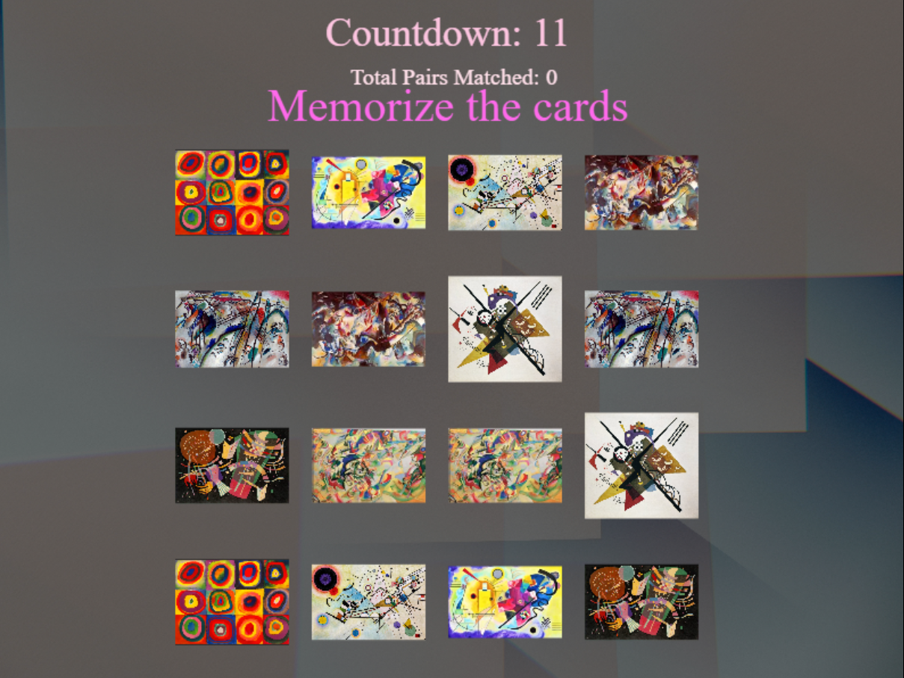
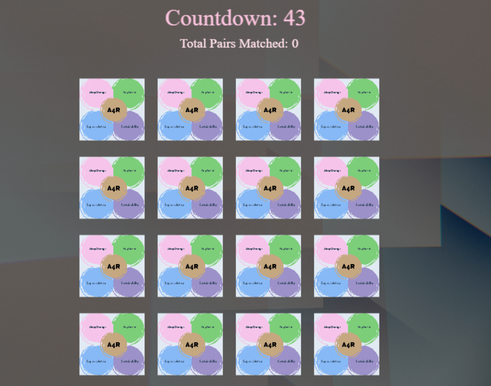

# Wassily Kandinsky Memory Game

## Overview

"Wassily Kandinsky Memory Game" is an educational and engaging game designed to provide players with an immersive experience of Kandinsky's art. Players can explore the vibrant world of abstract art through a memory card game featuring Kandinsky's iconic works. The game aims to enhance appreciation for abstract art while developing memory and concentration skills.

## Internship Project

This game is developed as part of an internship project, with the main goal of creating an impactful and informative game using Rosebud AI and the Phaser game framework. The project combines technical skill development with creative storytelling to produce a meaningful educational tool.

## Features

- **Educational Content**: Learn about Wassily Kandinsky and his contributions to abstract art.
- **Interactive Gameplay**: Match pairs of cards featuring Kandinsky's artworks.
- **Art-Inspired Design**: Enjoy a rich atmosphere with vibrant colors and artistic elements inspired by Kandinsky's style.
- **Memory Challenge**: Unlock various levels and artworks as you progress through the game.

## Technology Stack

- **Rosebud AI**: Utilized for generating assets and enhancing the creative process.
- **Phaser**: A powerful framework for developing 2D games, used to build and run the game.

## Live link

[Play the game here](https://costea47.github.io/Wassily-Kandinsky---Memory-Game-intership-/)

## Live on RosebudAi

[Check it out on RosebudAi](https://play.rosebud.ai/games/4bf7c148-50a8-4df5-a06b-df19dd195c83)

## Usage

The following image shows the challenge appearance and functionality:

## License

This project is licensed under the MIT License. See the [LICENSE](LICENSE) file for more details.

## Acknowledgements

- Special thanks to the Rosebud AI team for their support and resources.
- Inspired by the life and legacy of Wassily Kandinsky.
